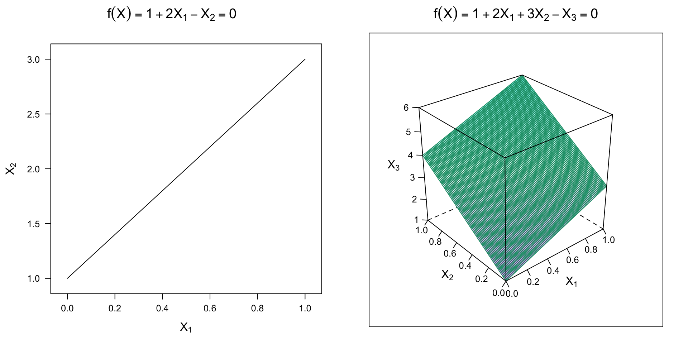
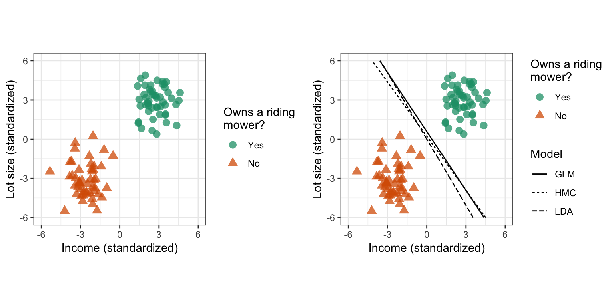
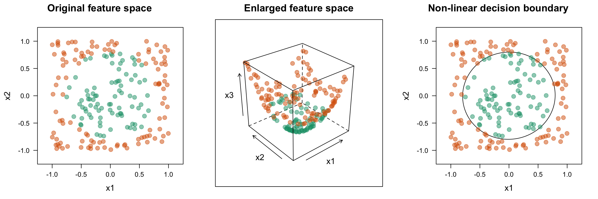
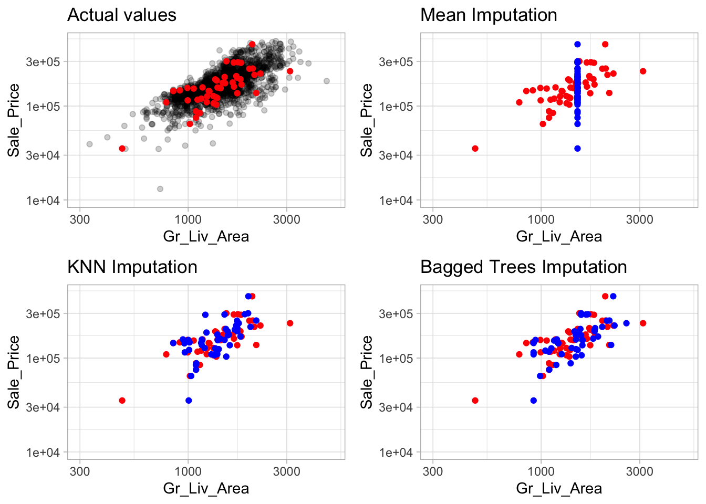

```{r setup, include=FALSE}
knitr::opts_chunk$set(echo = TRUE)
```

# Introducción

Para nuestro proyecto de Data Science (con R) escogimos el reto de [Kaggle](https://www.kaggle.com) titulado [*Titanic - Machine Learning from Disaster*](https://www.kaggle.com/c/titanic/overview). El cual, consiste en generar un modelo de Machine Learning (ML) que sea capaz de predecir la probabilidad de persona a sobrevivir al hundimiento de la mítica embarcación. En pocas palabras el reto consiste en resolver una tarea de clasificación.

Escogimos este reto por varias razones, la primera es el hecho de que Kaggle es la plataforma de Data Science y ML más grande del mundo, en donde se puede encontrar más de 50,000 datasets públicos y alrededor de 400,000 notebooks realizados por expertos. La segunda es que el *Titanic Challenge* es el reto más recomendado para empezar en las competencias de Kaggle y empaparse del mundo del Data Science y el ML.


## Dataset

El reto nos proporciona dos conjuntos de datos en formato `csv`, uno para el entrenamiento (datos etiquetados) y otro para la fase de prueba (sin etiquetas). En la siguiente tabla se encuentra una descripción de las columnas (variables) dentro del set de entrenamiento.

| Variable | Definición                       | Valores                   |
|----------|----------------------------------|---------------------------|
| survival | Sobreviviente                    | 0 = No, 1 = Si            |
| pcalss   | Clase del boleto                 | 1 = 1ra, 2 = 2da, 3 = 3ra |
| sex      | Sexo del pasajero                | 'male', 'female'          |
| sibsp    | \# de hermanos(as) / esposas(os) |                           |
| parch    | \# de padres / hijos             |                           |
| ticket   | Número del bolero                |                           |
| fare     | Precio del boleto                |                           |
| cabin    | Número de Cabina                 |                           |
| embarked | Puerto donde embarco             |                           |

# Desarrollo

## Prerrequisitos
Lo primero es cargar todos los paquetes que nos ayudaran en nuestras labores de análisis, transformación y modelado de los datos:

```{r libs, warning=FALSE}
# Data tools
library(dplyr)  # for data wrangling
library(rsample)  # for data spliting
library(recipes)  # for data transformation tasks

# Data visualization
library(ggplot2)  # for graphics
library(visdat)  # for data visualization

# Model tools
library(caret)  # for classification training
library(kernlab)  # for fitting SVMs
library(mlbench)  # for measure performance
```


## Cargar los datos

Lo siguiente es cargar el set de datos (`csv`) a un `data.frame`, esto es posible con:

```{r}
data.all <- read.csv("data/train.csv", na="") # Load the data
```

A la función de `read.csv` le agregamos el parametro `na=""` para indicarle a R que asigne el tipo de dato `NA` a los valores vacíos `""` dentro de nuestro dataset. Esto es importante para la fase de ingeniería de datos.

Podemos comprobar que el dataset se cargó correctamente visualizando una muestra de los registros con:

```{r}
head(data.all)  # observations sample
```

Además podemos revisar la estructura del `data.frame` con:

```{r}
str(data.all)  # structure in the dataset
```

Como se puede ver existen algunas inconsistencias en los tipos de datos; Las variables de tipo carácter fueron cargadas al `data.frame` como variables categóricas (`factor`), y algunas variables categóricas fueron cargadas como enteros. Para resolver estas inconsistencias podemos convertir cada variable del `data.frame` al tipo de dato que le corresponde:

```{r}
# Assign correct data types
data.all$Survived <- as.factor(data.all$Survived)
data.all$Pclass <- as.factor(data.all$Pclass)
data.all$Sex <- as.factor(data.all$Sex)
data.all$Embarked <- as.factor(data.all$Embarked)
data.all$Name <- as.character(data.all$Pclass)
data.all$Cabin <- as.character(data.all$Cabin)
data.all$Ticket <- as.character(data.all$Ticket)
data.all$Age <- as.integer(data.all$Age)

str(data.all) # verify changes
```

## Visualización de los datos
Una vez con el `data.frame` cargado correctamente y los tipos de datos ajustados. Procedemos a visualizar el dataset con algunas gráficas. Para esto utilizamos la librería de [`visdata`](https://github.com/ropensci/visdat), la cual permite realizar gráficas con información útil de los datos:

```{r}
vis_dat(data.all) # data visualization
```

En esta gráfica podemos ver las diferentes columnas del `data.frame`, sus tipos de datos, la cantidad de registros y los valores faltantes (`NA`).

Con `visdata` también podemos hacer una gráfica que nos muestre a más detalle esos valores faltantes:

```{r}
vis_miss(data.all, cluster=TRUE) # missing values viz
```

Como podemos ver en la gráfica, existe un significante cantidad de datos faltantes en las columnas de `Age` (8.1%) y aun pero en la columna `Cabin` (77.1%). Para obtener el dato exacto de datos faltantes podemos ejecutar el siguiente código:

```{r}
# Counting missing values
for(col in names(data.all)){
  print(sprintf("%s NA count: %d", col, sum(is.na(data.all[, col]))))
}
```

## El modelo
Para resolver la tarea de clasificación decidimos utilizar uno de los vistos en clase, Support Vector Machines (SVM's), este modelo se adapta perfecto a nuestras necesidades, ya que solo tenemos que predecir si una observación pertenece a una de dos clases.

El modelo de SVM utiliza el concepto del hiperplano para dividir a un conjunto de datos en diferentes clases en un espacio dimensional aumentado. Un hiperplano de $p$-dimensiones (# de variables) está definido por la siguiente ecuación lineal:

$$
f(X) = \beta_0 + \beta_1 X_1 + \cdots + \beta_p X_p = 0
$$

Cuando $p=2$ se forma una línea en un espacio 2D, y con $p=3$ se forma un plano en un espacio 3D (ver imagen). El SVM utiliza a este hiperplano para separar los datos en dos clases, una cuando el punto es $f(x) > 0$ y otra cuando $f(x) < 0$, esto después se codifica en una salida binaria $Y_i \in \{-1, 1\}$.



La idea clave detrás de SVM es encontrar los coeficientes $\beta$ para encontrar al hiperplano que mejor separe a los datos en la clase correcta.



Para lograr esto el modelo de SVM resuelve un problema de optimización cuadrático con restricciones. Sin entrar en detalles teóricos, SVM es capaz de encontrar una solución óptima $\beta^{*}$ del hiperplano con base en los datos de entrenamiento disponibles.

Para ilustrar un poco más el funcionamiento del SVM y destacar su utilidad en tareas de   clasificación, vamos a ver el siguiente ejemplo.



En la figura de la izquierda se pueden apreciar un conjunto de datos de dos clases en un espacio 2D. En este espacio (2D) no es posible dibujar una recta que nos permita separar a las dos clases. Por esta razón no es posible resolver la tarea con un modelo de regresión. Pero si analizamos los datos en un espacio dimensional mayor, en la imagen del medio se proyectan los datos en 3D, es posible ver como un plano podría *cortar* los datos y separarlos en dos conjuntos, esto pryectado de nuevo en 2D se percibe como el círculo de  la figura de la derecha.

## Ingeniería de datos

Ahora que tenemos los datos cargados y el modelo seleccionado. El siguiente paso es limpiar, ajustar y transformar los datos para que sean compatibles y óptimos para el entrenamiento. Las operaciones a realizar son las siguientes:

* Seleccionar las variables
* Lidiar con los valores faltantes (`NA`)
* Normalizar y estandarizar los valores numéricos
* Codificar las variables categóricas

Para realizar las transformaciones correspondientes a los datos se utiliza la librería [recipes](https://recipes.tidymodels.org/) que permite realizar ingeniería de datos al `data.frame`

### Selección de variables

Lo primero que haremos será descartar aquellas variables que no son útiles o que no aportan al entrenamiento. En nuestro caso las variables de tipo carácter:

* `ticket`: Esta variable contiene en caracteres alfanuméricos el número de serie del boleto, esta información no es determinante para la salida deseada del modelo.
* `cabin`: Similar ticket esta variable contiene el número de serie de la cabina para algunos pasajeros (menos del 30%), por lo que descarta del análisis.

Quedando la expresión $Y \sim X$ como:
$$
\text{Survival} \sim \text{Pclass} + \text{Sex} + \text{Age} + \text{Sibsp} + \text{Parch} + \text{Fare} + \text{Embarked}
$$

Esto se expresa como una *receta* en R con `recipies` de la siguiente forma:

```{r}
rec <- recipe(
  Survived ~ Pclass + Sex + Age + SibSp + Parch + Fare + Embarked,
  data = data.all
)
```


### Datos faltantes
Como descartamos las variables `cabin`, ahora solo tenemos que lidiar con los 177 registros faltantes de la columna `Age` y solo con 2 más de la columna `Embarket`. Existen varias opciones para lidiar con estos datos, descartar los registros faltantes o bien rellenar estos datos con alguna aproximación. Esta segunda se le llama imputación de datos y es posible realizar con `recipies` de la siguiente manera:

```{r}
rec <- rec %>% step_impute_knn(all_predictors(), neighbors = 6)
```

En esta línea se especifica una imputación de datos con el algoritmo de KNN, que predice el valor faltante con base en las otras variables de aquellos registros que estén completos, manteniendo la distribución de los datos. En la siguiente imagen se muestra una comparativa de los diferentes algoritmos de imputación disponibles en `recipies`.



Como se puede apreciar tanto el algoritmo de KNN y Badgged Trees mantienen la distribución de los datos originales.

### Estandarizar variables numéricas

Otra parte importante es estandarizar los valores numéricos. Esto es necesario porque el modelo de SVM es sensible a magnitudes altas. Esto podría causar, por ejemplo, que se le dé importancia de más a una variable cuando su valor es demasiado alto, como es el caso de los valores de la columna de `Age`, que contienen valores enteros en el rango de $0-100$.

```{r}
# Normalize numeric values
rec <- rec %>% step_BoxCox(all_numeric(), -all_outcomes())

# Standardize numeric values
rec <- rec %>%
  step_center(all_numeric(), -all_outcomes()) %>%
  step_scale(all_numeric(), -all_outcomes())
```

En estas dos líneas se realizan:

1. La transformación Box Cox, que nos permite corregir varianzas desiguales y corregir la no linealidad.
2. Una estandarización de los valores mediante un centrado y escalamiento de los valores.

### Codificar variables categóricas

Algunos modelos de ML, como el de SVM, requieren que las variables de entrada ($X$) sean estrictamente numéricas. Para el caso de las binarias como `Sex` no existe problema, pero las variables con más de 2 niveles como `Embarket` que tiene 3 niveles entramos en un problema. Sin entrar en muchos detalles, es necesario realizar una codificación, como si de números binarios se tratara. Esta transformación es conocida como *One-hot encoding* y *dummy encoding* que solo varían en el número de columnas:

```{r}
rec <- rec %>% step_dummy(all_nominal_predictors())
```

### Realizar transformaciones

Cada uno de los pasos anteriores agrega un *paso* a la *receta* de los pasos a realizar con los datos. Para *preparar* y *cocinar* la *receta* con `recipies` es necesario lo siguiente:

```{r}
# Prepare the recipe
rec <- prep(rec, training = data.all)

# Perform all operations
data.clean <- bake(rec, new_data = data.all)
```

Y finalmente visualizamos los nuevos datos transformados:

```{r}
vis_dat(data.clean) # Vizualization the clean data
```

Como se aprecia en la gráfica podemos apreciar que:

* Todos las variables de entrada $X$ son numéricas.
* Ya no existen valores `NA`, estos fueron rellenados con el algoritmo de KNN.
* Las variables categóricas fueron codificadas en más columnas.

## Entrenamiento del modelo

### Dividir el dataset

Ahora que limpiarlos y estandarizamos los datos y rellenamos los huecos con la mejor aproximación (manteniendo la distribución). El paso que sigue es separa nuestros datos en dos subconjunto: uno para entrenamiento y otro para validación. Esto se puede hacer con la librería [`rsample`](https://rsample.tidymodels.org/):

```{r}
# Split data in training and test set
set.seed(123)  # for reproducibility
spliter <- initial_split(data.clean, prob=0.8, strata = "Survived")
data.train <- training(spliter)
data.test <- testing(spliter)
```

En estas líneas se reserva el 80% de los datos para el entrenamiento y el 20% para validación. El algoritmo de `rsample` mantiene la distribución de los datos en ambos subconjuntos con base en la variable `Survived`.

### Hiper-parámetros del modelo
Nosotros estamos utilizando el modelo de SVM radial. Del cual podemos obtener la lista de hiper-parámetros que se deben de ajustar del modelo con la siguiente línea:

```{r}
caret::getModelInfo("svmRadial")$svmRadial$parameters # model infor
```

### Ajuste del modelo (entrenamiento)

Utilizando la librería de [`caret`](https://topepo.github.io/caret/) podemos entrenar al modelo especificando los datos de entrenamiento, el tipo de modelo y la estrategia para ajustar los hiper-parámetros (automaticamente) con:

```{r}
# Model fitting
set.seed(6465)  # for reproducibility
model <- train(
  Survived ~ .,  # target fromula
  data = data.train,  # training data
  method = "svmRadial",  # SVM with radial basis fuunction: K(x,x') = exp(gamma norm(x-x')^2),
  trControl = trainControl(method="repeatedcv", number=10, repeats=3),   # repeted k-fold cross valdiation
  preProcess = c("center","scale"),
  tuneLength = 10
)

model  # model summary
```

Para obtener más información del entrenamiento podemos realizar una gráfica de la evolución de la función de costo durante el entrenamiento con `ggplot`:

```{r}
ggplot(model)
```

## Resultados

Una vez entrenado el modelo, podemos utilizar el subconjunto de validación para realizar inferencias y medir la eficiencia del modelo comparando las predicciones con los valores de referencia:

```{r}
# Test the model
predictions <- predict(model, data.test)

# Measuring model performance
confusionMatrix(data = predictions, reference = data.test$Survived)
```

# Referencias